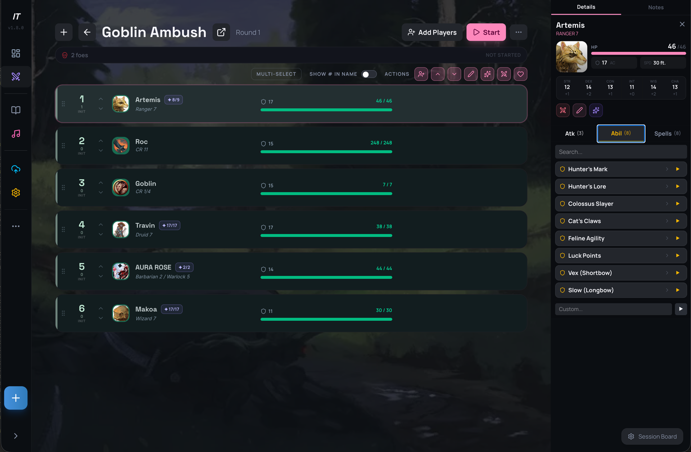
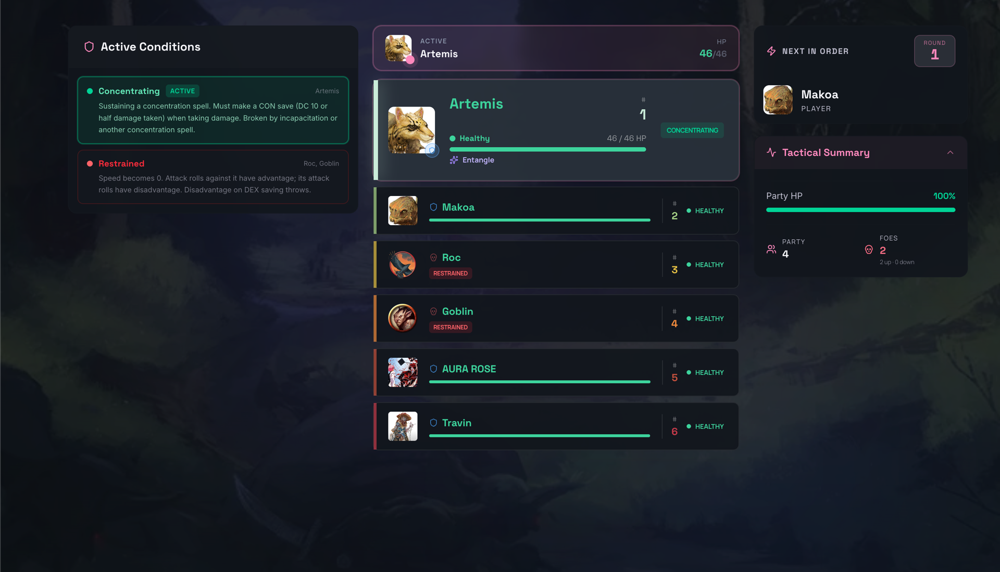
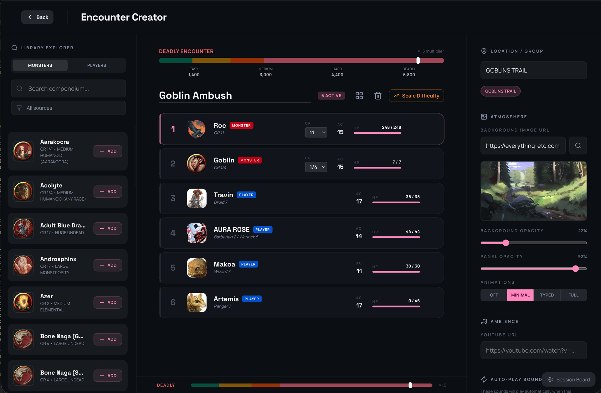
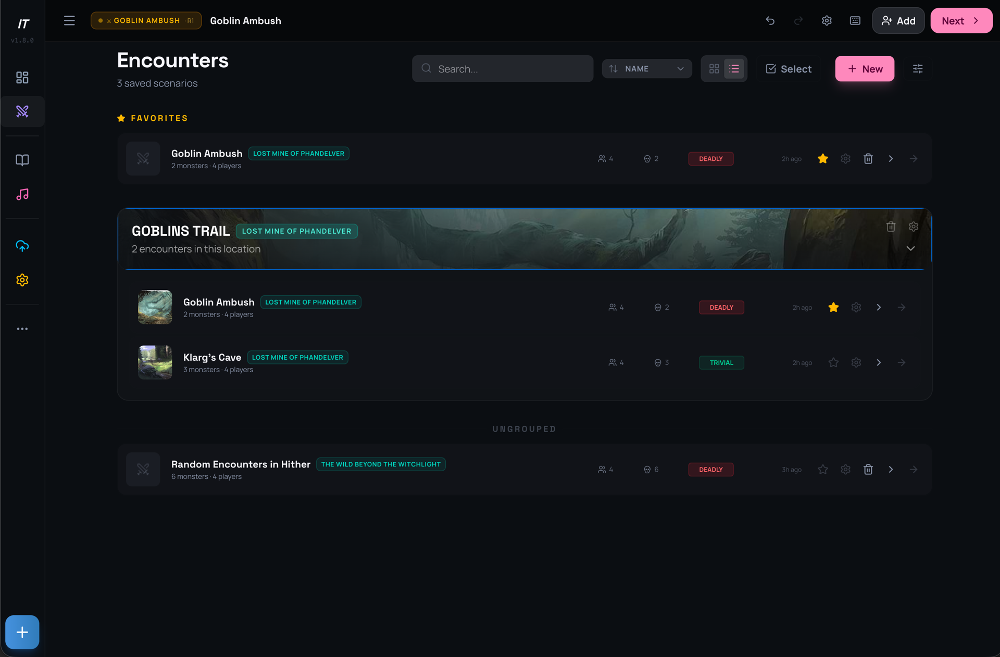
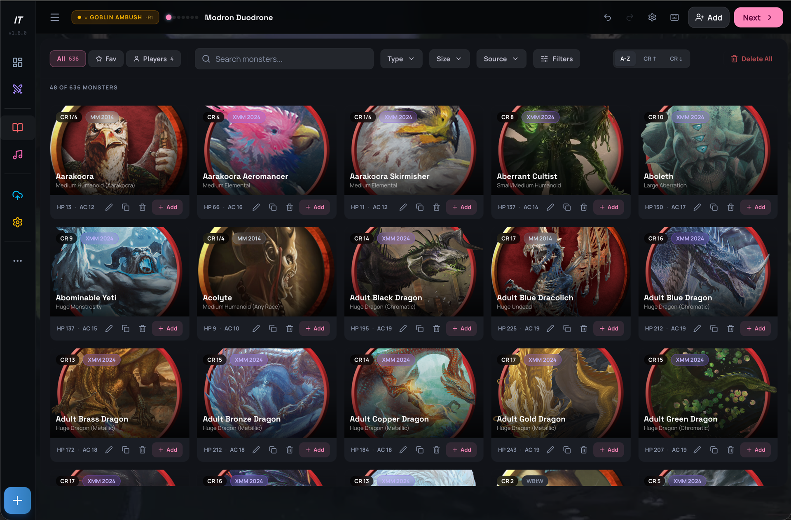
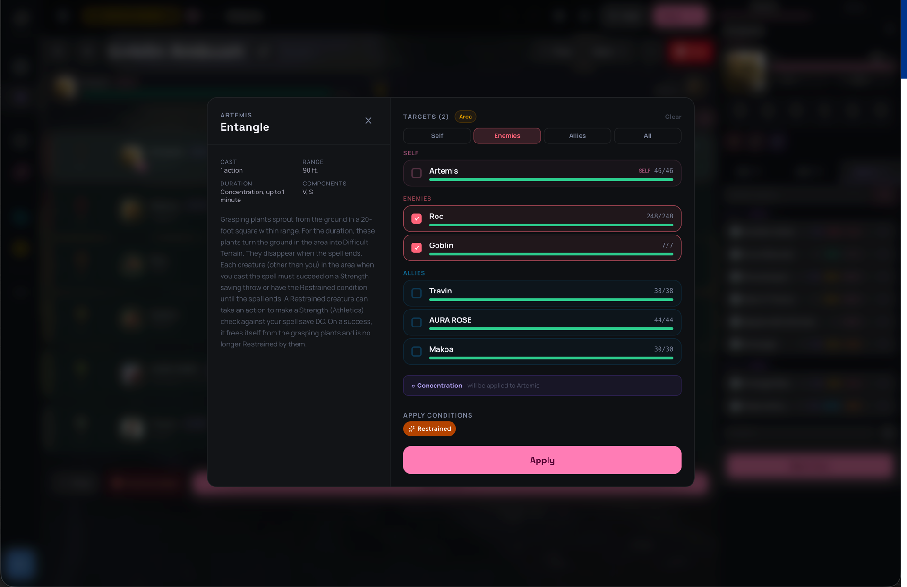
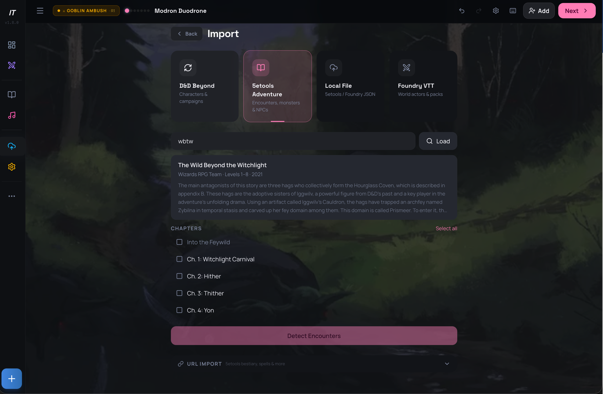
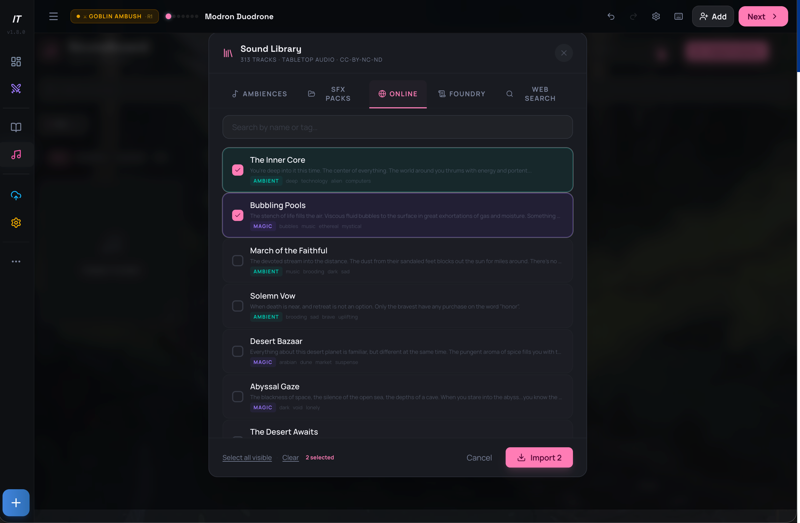
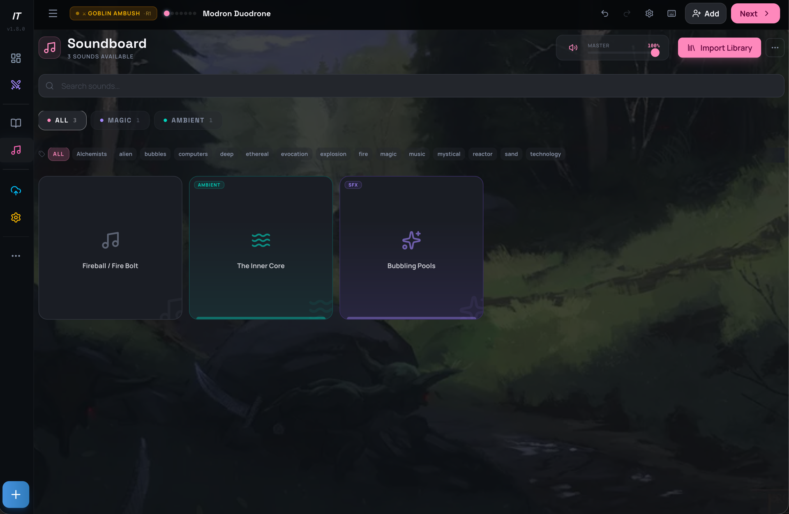

# Initiative Tracker

**A self-hosted, open-source D&D 5e combat tracker for Dungeon Masters — an alternative to Improved Initiative and D&D Beyond's encounter tools that you own end to end.**

Prep encounters, run initiative, and share a live player view


[](LICENSE)


<!-- Drop a screenshot or demo GIF at docs/demo.gif (a 20–30s clip of a real combat converts best) -->


## Preview

Try the hosted preview at <https://dnd-initiative-and-more.onrender.com/dashboard>.

This is a free Render deployment intended for evaluation. The service may sleep when idle and its local SQLite data can be reset, so use a self-hosted deployment for important campaigns.

## Why

Most combat trackers are either cloud-locked, subscription-gated, or tied to a single VTT. Initiative Tracker runs on your own hardware, works at the table without internet, and hands players a read-only view of the fight — all from one Docker command.

## Features

- **Encounter prep** — create, save, filter, scale to party size, and resume encounters.
- **Full 5e combat** — initiative, HP/temp HP, conditions, concentration, death saves, spell slots, feature uses, polymorph, legendary & lair actions, and undo/redo.
- **Live player view** — share the fight in real time over Socket.IO; players see what they should, nothing they shouldn't.
- **Basic Mode** — a one-click toggle that strips the UI down to just Encounters and Monsters for guests and new players.
- **Import anything** — pull in D&D Beyond and Foundry VTT data, or parse adventure text straight into encounters.
- **Campaigns & sessions** — organize your table with a configurable session board.
- **Soundboard** — optional spatial audio and smart-lighting effects for ambiance.

## Screenshots

| | |
|---|---|
| **Combat tracker** — run initiative, HP, and conditions | **Player view** — live, read-only view for the table |
|  |  |
| **Encounter creator** — build and scale encounters | **Encounter vault** — organize encounters by location | 
|  |  |
| **Monster library** — browse the full bestiary | **Spellcasting** — apply spells and effects to targets |
|  |  |
| **Adventure import** — pull encounters from adventure files, D&D Beyond, and Foundry | **Sound import** — add ambiences and effects from your library |
|  |  |
| **Soundboard** — ambient audio and lighting cues | |
|  | |

## Quick start

Requires Node.js 22 LTS (the Docker image uses Node 22).

```bash
npm install
npm run dev
```

Open <http://localhost:3000>. On first startup, the server creates an `admin` account. Set `ADMIN_PASSWORD` before the first startup to choose its password; otherwise, use the generated password printed by the server.

Copy `.env.example` to `.env` to configure production credentials or optional integrations. Never commit `.env`.

### Configuration

The only required production settings are:

| Variable | Purpose |
|---|---|
| `SESSION_SECRET` | Signs login sessions. Use a long random value. |
| `ADMIN_PASSWORD` | Sets the initial administrator password on first startup. |
| `DISABLE_LAN_AUTH_BYPASS` | Set to `true` when publicly hosted to require login from every network. |

Optional settings enable local audio, Foundry VTT imports, D&D Beyond seeding, Philips Hue, and Home Assistant. See [.env.example](.env.example) for the complete list. Integration credentials are stored locally in SQLite and should be treated as secrets.

## Docker

```bash
cp .env.example .env
# Set SESSION_SECRET and ADMIN_PASSWORD in .env.
docker compose up --build -d
```

The default deployment listens on <http://localhost:3001> and persists SQLite data in `./data`. The base Compose file does not mount personal audio libraries or Foundry data. To use either integration, mount a host directory into the container and set `AUDIO_SFX_DIR`, `AUDIO_AMBIENCES_DIR`, or `FOUNDRY_DATA_PATH` to its container path.

### Backups and recovery

Administrators can export tracker data as a versioned JSON backup from Settings and restore it with explicit confirmation. Backups include encounters, combatants, monsters, players, campaigns, sessions, spells, class features, sounds, and settings, but never passwords or uploaded files. Keep backups outside the repository and protect them like any other campaign data.

## Architecture

The application is a single Node.js process: Express serves the API and production frontend, Socket.IO broadcasts live encounter updates, and SQLite stores structured data. The frontend is React/TypeScript with Vite and Tailwind CSS. See [ARCHITECTURE.md](ARCHITECTURE.md) for runtime boundaries, authentication, live updates, and integrations.

## Contributing

Bug reports and pull requests are welcome. Please read [CONTRIBUTING.md](CONTRIBUTING.md) first. Keep runtime databases, uploads, credentials, private network details, and personal filesystem paths out of issues and commits.

## Development

```bash
npm run lint       # TypeScript check
npm test           # frontend and backend Vitest projects
npm run build      # production Vite build
npm run seed       # populate the monster and spell library
```

See [ARCHITECTURE.md](ARCHITECTURE.md) for system design, [CONTRIBUTING.md](CONTRIBUTING.md) for collaboration guidelines, and [docs/README.md](docs/README.md) for the documentation index.

## License

This project is released under the [MIT License](LICENSE).
